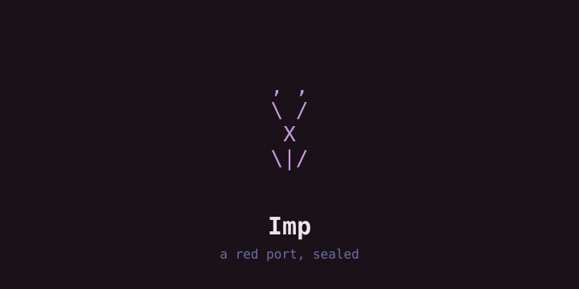
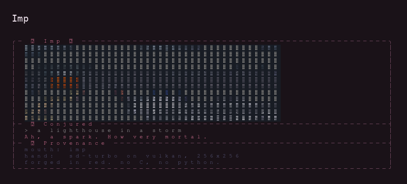
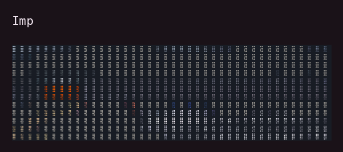
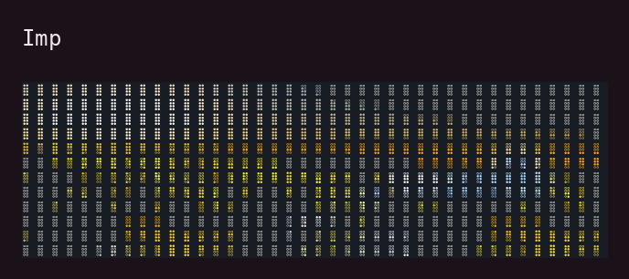

# Imp — terminal art dragon 🐲

> **a grumpy dragon that paints terminal art from a wish — and mocks it**

Imp conjures ANSI art from a wish. A haiku dragon called Imp's Comment
snarks about the result. Every piece is saved to `~/pixie_art/` as `.txt`
(plus a dependency-free `.pdf`) and indexed in a gallery.

Imp is written in **Red** — and it is written to be *evil in its intent,
harmless in its effect*. The code is arranged so that a reader feels
watched, while the filesystem never notices. This is deliberate, it is
capped by a written ceiling, and the key to every true name is published
in [`docs/GRIMOIRE.md`](docs/GRIMOIRE.md) — because a curse you cannot
escape is a trap, and this is not a trap.

Why it is like this: [`docs/ORIGIN.md`](docs/ORIGIN.md). What it may and
may never do: [`docs/COVENANT.md`](docs/COVENANT.md). The language itself,
measured on the interpreter we ship and cross-checked against the official
specification: [`docs/RED.md`](docs/RED.md). Idioms, studied from 652 files
of real Red: [`docs/RED-IDIOMS.md`](docs/RED-IDIOMS.md). What other people
have built in Red: [`docs/RED-PROJECTS.md`](docs/RED-PROJECTS.md).

## Look





```
,   ,
 \ /
  X
 \|/
```

## Status

**It runs.** `imp "a wish"` and the interactive TUI both paint a frame.

- **Art core — sealed.** `reap` is proven byte-for-byte against the Python
  original across `unicode`, `ansi16`, `ansi256`, `truecolor` and `ascii`,
  CJK included, including a faithfully preserved bug.
- **The mind is Red.** Art, grid, snark, covenant, wounds. Pure function:
  job file in, frame file out, one 0.12s process per action.
- **The body is borrowed.** `src/bridge.c` owns the terminal, the keys and
  every wait, because `red-view` has no `sleep`, cannot read a pipe, and
  has no stdout. A demon in a borrowed body is a better demon than a demon
  in a glass house.
- **The art is still the imp's own sample.** The llama client is not built
  yet, and the frame says so in plain words. A smoother line would read
  better; the frame keeps the plain one instead of performing success.

**To come:** the llama client, the gallery and its hour-ordering curse,
the PDF writer, the escalating dragon.

**Read [`docs/RED.md`](docs/RED.md)** before writing a rite. It is the
language manual for this exact build, and it corrected seven beliefs this
project had recorded as fact.

## Use

```bash
imp                          # interactive TUI (type a wish, Enter to conjure)
imp "a moonlit mushroom"     # one-shot: print the art, save to the gallery
imp --gallery                # list saved pieces (ordered by the hour — not by time)
imp --demo                   # render a sample frame, no server needed
imp "…" --style ascii|unicode|ansi16|ansi256|truecolor
imp "…" --width W --height H --batch --save FILE
imp "…" --animate --frames N --anim-prompt "…"
```

Keys: `Enter` conjure · `e` edit · `a` animate · `r` refine · `s` save ·
`g` gallery · `/` history · `Tab` style · `c` clear · `←/→` scrub · `q` quit

## Build

Imp is Red source plus a small C body. There is no released binary; the
vessel runs it.

```bash
./build.sh              # verify the substrate and the sealed core
./build.sh install      # compile the body to ~/bin/imp
./rited src/render.red /dev/shm/imp/render.log   # cast a rite, read its testimony
./rited tests/rites/rite-two.red verdict.txt      # the eight seals
```

`rited` is the oracle harness: it stages the rite in the repo root (the
console cannot load from a subdirectory), casts it, and prints the
testimony file. The console is the only interpreter this language ships on
Linux, and it is the only way to hear the imp speak.

## Engines

| Role | Default | Alias | Port |
|------|---------|-------|------|
| Art | `http://127.0.0.1:8082` | `imp` | `PIXIE_LLM_URL` |
| Comment | `http://127.0.0.1:8081` | `kur` | `KUR_LLM_URL` |

Non-loopback URLs are refused unless `IMP_ALLOW_REMOTE=1`.

## State

- Art + PDF: `~/pixie_art/<id>.txt`, `<id>.pdf`
- Animation: `<id>_anim.txt`, `<id>_anim.pdf`
- Gallery index: `~/.cache/pixie/imp/gallery.json` (cap **666**)

## The wound you will notice

Under `--style ansi256` and `--style truecolor` the art renders
monochrome. This is a preserved bug from the Python original, kept as
canon and sealed by a test. It is written up in
[`docs/GRIMOIRE.md`](docs/GRIMOIRE.md#the-wounds-we-keep-on-purpose).
Fixing it is a two-line change and a law amendment.

## License

MIT — see [LICENSE](LICENSE). Art you conjure is yours.
